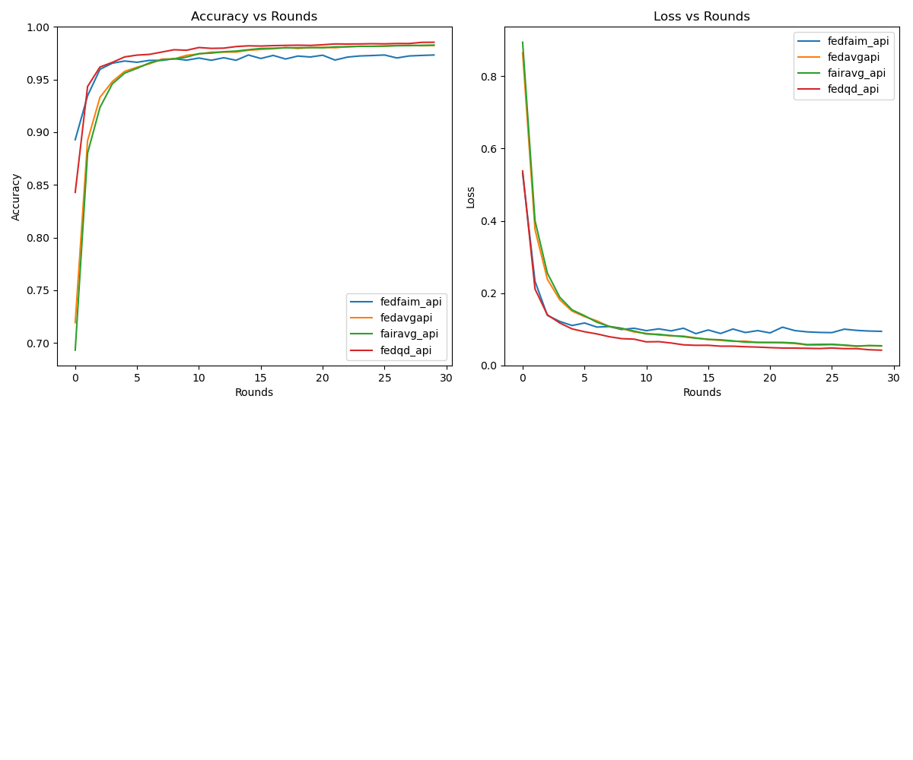

<div align="center">
<h1 align="center">CFLF</h1>
Federated Learning Experimentation and Visualization System


</div>

# 📜 项目简介
本项目致力于复现联邦学习领域内的重要算法，并进行对比实验。通过高度模块化和可扩展的代码结构，实现对不同联邦学习算法的快速迭代和测试。
进一步，本项目还旨在建立一个联邦学习可视化系统，以增强算法理解和分析效率。

# ✨ 项目特性
- 🔄 算法复现：复现了诸如FedAvg, FedFAIM等联邦学习核心算法。
- 📊 性能对比：提供了标准化的性能对比工具，可直观比较不同算法。
- 📈 可视化系统：开发了可视化工具，以图形方式显示训练进度和结果。
- 🛠 模块化设计：代码结构清晰，模块化设计便于扩展和维护。
- 📝 扩展升级：框架设计考虑了联邦学习的潜在算法与应用的扩展。

## 🏗 项目结构
```plaintext
CFLF/
├── algo/
│   ├── FedAvg/
│   └── FedFAIM/
├── data/
│   ├── data_loader.py
│   ├── dataset.py
│   └── partition.py
├── model/
│   ├── cifar_cnn.py
│   └── mnist_cnn.py
├── utils/
│   ├── gradient.py
│   └── model_trainer.py
└── main.py
```

## 主要路径
- 实验运行路径：[main.py](main.py)
- 实验配置路径：[option.py](option.py)
- 算法API路径：[algo](algo)
- 数据集逻辑路径：[data](data)
- 模型逻辑路径：[model](model)
- 工具集路径：[utils](utils)
<br/><br/>

## 🚀 快速开始
1. Clone the repository locally:
```bash
git clone https://github.com/your_github/FL-Experiment.git
```
2. Install dependencies:
```bash
pip install -r requirements.txt
```
3. Run the main program:
```bash
python main.py --args
```
## 📓 复现记录
### Paper: FedFAIM: a model performance-based fair incentive mechanism for federated learning
<details>

#### 梯度聚合
- [x] FedAvg:
  - **Approach**: Built client and server models based on the original paper description.
  - **Challenges**: Encountered issues with inconsistent weights during model aggregation.
  - **Outcome**: Successfully addressed the issue and replicated performance similar to the original paper.
- [x] FedFAIM:
  - **Approach**: add gradient aggreation, contribution assessment, reaward allocation on fedavg.
  - **Challenges**: Encountered issues with inconsistent weights during model aggregation.
  - **Outcome**: Successfully addressed the issue and replicated performance similar to the original paper.
- [x] FairAvg:
  - **Approach**: 
  - **Challenges**: 
  - **Outcome**: 
- [x] FedQD:
  - **Approach**: 
  - **Challenges**: 
  - **Outcome**:

运行结果

虽然算法部分已经和原文对齐，但实验结果与原文对比，有以下待解决问题：
1. FedFAIM算法到最后的表现远不如其他的算法，需要搞清楚是不是梯度定制的问题
2. niid场景下所有算法的精度过于高，需要检验

#### 贡献评估
- [x] CI:
  - **Approach**: 
  - **Challenges**: 
  - **Outcome**:
- [x] TMC-Shapley:
  - **Approach**: 
  - **Challenges**: 
  - **Outcome**:
- [x] GTB:
  - **Approach**: 
  - **Challenges**: 
  - **Outcome**:
- [x] COS-SIM:
  - **Approach**: 
  - **Challenges**: 
  - **Outcome**:
#### 梯度定制
- [x] CFFL:
  - **Approach**:
  - **Challenges**: 
  - **Outcome**:
- [x] RFFL:
  - **Approach**: 
  - **Challenges**: 
  - **Outcome**:
</details>

## 📓 复现记录
### Paper: Improving_Federated_Learning_With_Quality-Aware_User_Incentive_and_Auto-Weighted_Model_Aggregation
<details>
#### 实验设置

- [x] 模型:
  - **Approach**: 
  - **Challenges**: 
  - **Outcome**:
- [x] 数据集:
  - **Approach**: 
  - **Challenges**: 
  - **Outcome**:
#### 学习质量估计模块
- [x] FedQD:
  - **Approach**: 
  - **Challenges**: 
  - **Outcome**:
#### 学习质量估计模块
- [x] FedQD:
  - **Approach**: 
  - **Challenges**: 
  - **Outcome**:
#### 学习质量估计模块
- [x] FedQD:
  - **Approach**: 
  - **Challenges**: 
  - **Outcome**:
</details>
## License
该项目基于[Apache-2.0 License](LICENSE)许可证开源<br/>
This project is released under the [Apache-2.0 License](LICENSE).<br/>